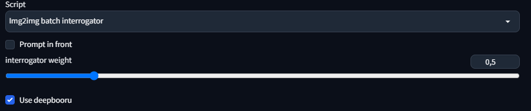

# Img2img batch interrogator for A1111
script that runs the interrogator before processing each image

[idea](https://www.reddit.com/r/StableDiffusion/comments/122w8u2/batch_img2img_with_automatic_interrogate_clip_in/)

## Help Doc
For the script to run, make sure that a interrogator is selected.

The interrogators will run in the order of user selection.

If user does not have a installed, and enabled version of `clip-interrogator-ext`, then `CLIP (EXT)` will not appear in the interrogator selection dropdown menu.

If user does not have a installed, and enabled version of `stable-diffusion-webui-wd14-tagger`, then `WD (EXT)` will not appear in the interrogator selection dropdown menu.

User can determine if the interrogation result is positioned at the beginning or end of the prompt.

### CLIP EXT Options
This menu will only appear if `CLIP (EXT)` is selected.

Users may select multiple interrogation models, interrogators will run in the order of user selection.

User may select what mode the CLIP extention interrogator will run in: `best`, `fast`, `classic`, or `negative`

User has the option to keep interrogators loaded or have interrogators unloaded at the end of each interrogation.
 - It is advisable to unload models because of memory usage, however, keeping model loaded will be faster
  
User has the ability to unload all CLIP interrogation models by pressing the `Unload All CLIP Interrogators` button.
 - User can also unload CLIP interrogators from the CLIP interrogator extention tab.

### WD EXT Options
This menu will only appear if `WD (EXT)` is selected.

Users may select multiple tagger models, taggers will run in the order of user selection.

Tagger models will use `threshold` to determine if a suspected tag should be applied. Tags that do not meet the threshold will not be applied.

User has the option to remove underscores from tags. The models inherently have underscores between words instead of spaces, this option replaces underscores with spaces. 
  - To ensure that this option does not mutilate text emojis, underscores are compared against a list of underscore emojis to determine if replacement is nessassary.

User has the option to keep taggers loaded or have taggers unloaded at the end of each interrogation.
 - It is advisable to unload models because of memory usage, however, keeping model loaded will be faster
  
User has the ability to unload all tagger models by pressing the `Unload All Tagger Models` button.
 - User can also unload CLIP interrogators from the CLIP interrogator extention tab.

### Filtering Tools
Users have the ability to filter content out of the interrogation prompts. 

 - Users can remove content from interrogations that was already added by the user in the prompt, this prevents exageration of prompt entries.
 - Users can remove content from interrogations that is in the negative prompt, this prevents contradicting the negative prompt.
 - Users can create their own custom filter to remove content from interrogations without modifying the prompt or negative prompt.
   - Users can add their custom filter to the provided textbox. Please note, any attention syntax will be ignored, as any entry matching added entries are filtered.
   - User can optimize custom filter, optimize will remove duplicate entries, extra spaces, and empty entries.
   - User can load custom filter from the previous save
   - User can scae custom filter for future use

**WARNING: Saving the custom filter will overwrite previous custom filter save.**

### Experimental Tools
A bunch of tools that were added that are helpful with understanding the script, or offer greater variety with interrogation output.

 - [Debug Mode]: DEBUG statements will be printed to console log.
 - [Reverse Mode]: Interrogation will be added to the negative prompt.
 - [No Puncuation Mode]: Interrogation will be filtered of all puncuations (except for a variety of emoji art).
 - [Exaggeration Mode]: Interrogators will be permitted to add depulicate responses.
 - [Interrogator Prompt Weight]: Use attention syntax on interrogation.
 - [Prompt Output]: Prompt statements will be printed to console log after every interrogation.

## To Do
- [x] ~~Use native A1111 interrogator~~
- [x] ~~Use CLIP extension interrogator~~
- [x] ~~Use WD14 extention taggers~~
- [ ] Use e621 tagger (User should be able to do this themself by adding e621 to their WD14 extention)
- [ ] Make extention options dynamically added, instead of static visibility modification (so options could be applied to models individually)
  - [ ] Add the option to add model output to either prompt or negative prompt individually (Helpful for CLIP negative mode)
- [ ] Add a find and remove option to the custom filter
- [ ] Add a find and replace option to the custom filter
- [ ] Add the option to insert interrogation to user specified point in the prompt
