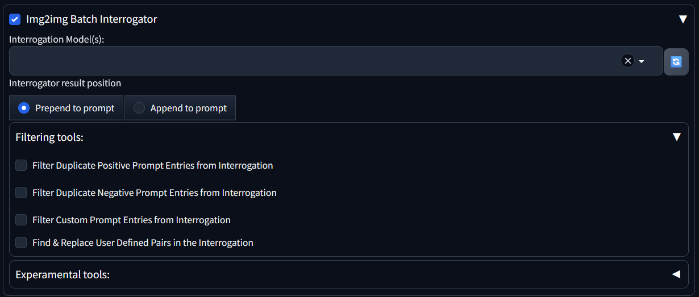
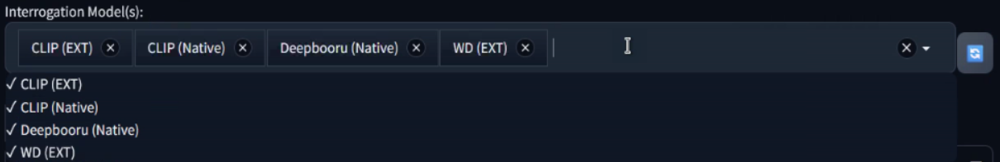
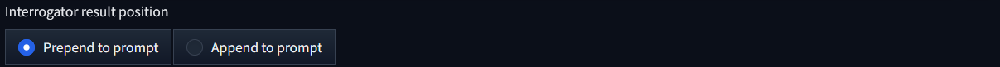
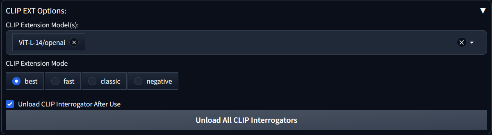
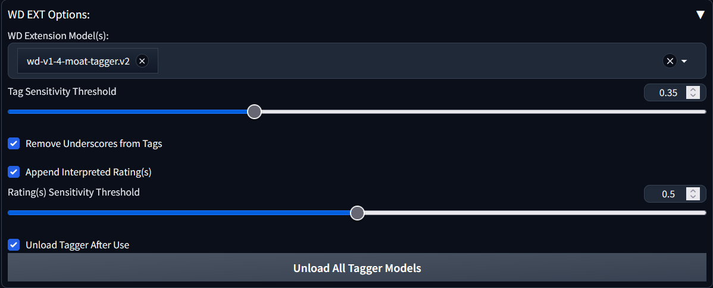
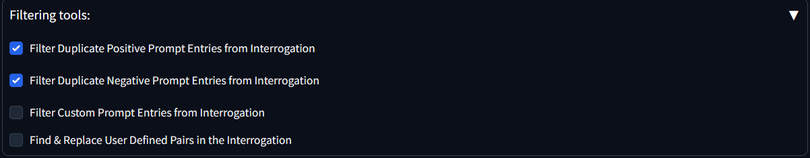
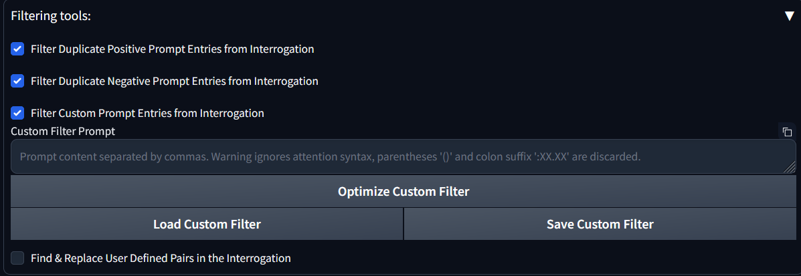
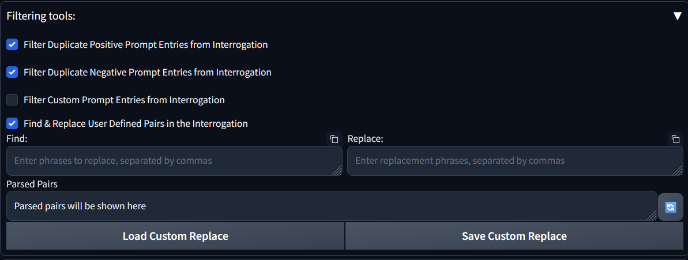
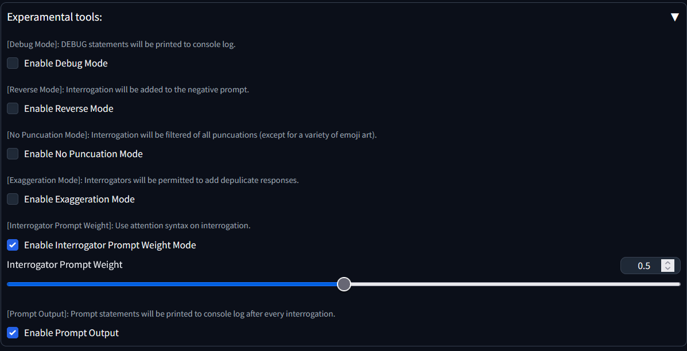

# Img2img batch interrogator for A1111
script that runs the interrogator before processing each image

[idea](https://www.reddit.com/r/StableDiffusion/comments/122w8u2/batch_img2img_with_automatic_interrogate_clip_in/)

## Help Doc
For the script to run, make sure that script checkbox is checked and a interrogator is selected.

[`Interrogation Model(s)`]: The interrogators will run in the order of user selection.

[`CLIP (EXT)`]: If user does not have a installed, and enabled version of `clip-interrogator-ext`, then `CLIP (EXT)` will not appear in the interrogator selection dropdown menu.

[`WD (EXT)`]: If user does not have a installed, and enabled version of `stable-diffusion-webui-wd14-tagger`, then `WD (EXT)` will not appear in the interrogator selection dropdown menu.

[`Interrogator results position`]: User can determine if the interrogation result is positioned at the beginning or end of the prompt.

### CLIP EXT Options
This menu will only appear if `CLIP (EXT)` is selected.

[`CLIP Extension Model(s)`]: Users may select multiple interrogation models, interrogators will run in the order of user selection.

[`CLIP Extension Mode`]: User may select what mode the CLIP extention interrogator will run in: `best`, `fast`, `classic`, or `negative`

[`Unload CLIP Interrogator After Use`]: User has the option to keep interrogators loaded or have interrogators unloaded at the end of each interrogation.
 - It is advisable to unload models because of memory usage, however, keeping model loaded will be faster
  
[`Unload All CLIP Interrogators`]: User has the ability to unload all CLIP interrogation models by pressing the `Unload All CLIP Interrogators` button.
 - User can also unload CLIP interrogators from the CLIP interrogator extention tab.

### WD EXT Options
This menu will only appear if `WD (EXT)` is selected.

[`WD Extension Model(s)`]: Users may select multiple tagger models, taggers will run in the order of user selection.

[`Tag Sensitivity Threshold`]: Tagger models will use `threshold` to determine if a suspected tag should be applied. Tags that do not meet the threshold will not be applied.

[`Remove Underscores from Tags`]: User has the option to remove underscores from tags. The models inherently have underscores between words instead of spaces, this option replaces underscores with spaces. 
  - To ensure that this option does not mutilate text emojis, underscores are compared against a list of underscore emojis to determine if replacement is nessassary.

[`Append Interpreted Rating(s)`]: User has the option to append the rating to each interrogation.
 - [`Rating(s) Sensitivity Threshold`]: If `Append Interpreted Rating(s)` is disabled this slider will be hidden.
 - Note, setting the rating sensitivity to zero will result in all ratings being appended.

[`Unload Tagger After Use`]: User has the option to keep taggers loaded or have taggers unloaded at the end of each interrogation.
 - It is advisable to unload models because of memory usage, however, keeping model loaded will be faster
  
[`Unload All Tagger Models`]: User has the ability to unload all tagger models by pressing the `Unload All Tagger Models` button.
 - User can also unload CLIP interrogators from the CLIP interrogator extention tab.

### Filtering Tools
Users have the ability to filter content out of the interrogation prompts. 

 - [`Filter Duplicate Positive Prompt Entries from Interrogation`]: Users can remove content from interrogations that was already added by the user in the prompt, this prevents exageration of prompt entries.
 - [`Filter Duplicate Negative Prompt Entries from Interrogation`]: Users can remove content from interrogations that is in the negative prompt, this prevents contradicting the negative prompt.
 - [`Filter Custom Prompt Entries from Interrogation`]: Users can create their own custom filter to remove content from interrogations without modifying the prompt or negative prompt.

   - Note, if `Filter Custom Prompt Entries from Interrogation` is not enabled, options associated with it will be hidden
   - [`Custom Filter Prompt`]: Users can add their custom filter to the provided textbox. Please note, any attention syntax will be ignored, as any entry matching added entries are filtered.
   - [`Optimize Custom FIlter`]: User can optimize custom filter, optimize will remove duplicate entries, extra spaces, and empty entries.
   - [`Load Custom Filter`]: User can load custom filter from the previous save
   - [`Save Custom Filter`]: User can scae custom filter for future use
**WARNING: Saving the custom filter will overwrite previous custom filter save.**

 - [`Find & Replace User Defined Pairs in the Interrogation`]: Users can create their own custom find and replace lists to replace words and phrases in the interrogations without modifying the prompt or negative prompt.

   - Note, if `Find & Replace User Defined Pairs in the Interrogation` is not enabled, options associated with it will be hidden
   - [`Find`]: Users can add their custom phrases and words, seperated by comma, to find in the provided textbox.
   - [`Replace`]: Users can add their custom phrases and words replacements, seperated by comma, in the provided textbox. Leaving an entry blank will result in deleting the word from the interrogation prompt.
   - [`Parsed Pairs Visualizer`]: These two lists of find phrases and words will be paired with their replace counterparts. Pairing is based on order in the lists.
   - [`Load Custom Replace`]: User can load custom replace from the previous save
   - [`Save Custom Replace`]: User can scae custom replace for future use
**WARNING: Saving the custom replace lists will overwrite previous custom replace lists save.**

### Experimental Tools
A bunch of tools that were added that are helpful with understanding the script, or offer greater variety with interrogation output.

 - [`Enable Debug Mode`]: DEBUG statements will be printed to console log.
 - [`Enable Reverse Mode`]: Interrogation will be added to the negative prompt.
 - [`Enable No Puncuation Mode`]: Interrogation will be filtered of all puncuations (except for a variety of emoji art).
 - [`Enable Exaggeration Mode`]: Interrogators will be permitted to add depulicate responses.
 - [`Enable Interrogator Prompt Weight`]: Use attention syntax on interrogation.
    - [`Interrogator Prompt Weight`]: This slider will specify the attention weight.
       - This option is hidden if `Enable Interrogator Prompt Weight` is not enabled.
 - [`Enable Prompt Output`]: Prompt statements will be printed to console log after every interrogation.

## To Do
- [x] ~~Use native A1111 interrogator~~
- [x] ~~Use CLIP extension interrogator~~
- [x] ~~Use WD14 extention taggers~~
  - [x] ~~Add the option to append ratings to interrogation~~
- [x] ~~Use e621 tagger~~ (User should be able to use e621 by adding e621 to their WD14 extention)
- [ ] Make extention options dynamically added, instead of static visibility modification (so options could be applied to models individually)
  - [ ] Add the option to add model output to either prompt or negative prompt individually (Helpful for CLIP negative mode)
- [x] ~~Add a find and remove option to the custom filter~~
- [x] ~~Add a find and replace option to the custom filter~~
- [ ] Add the option to insert interrogation to user specified point in the prompt
